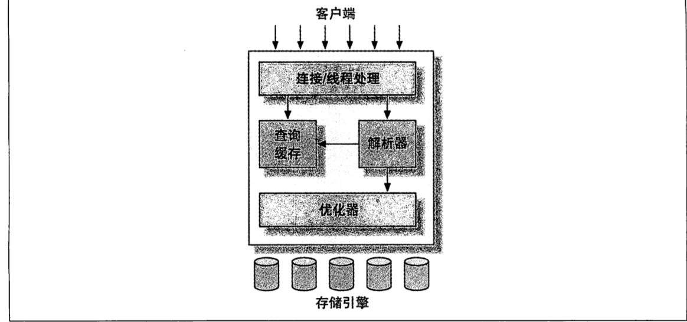
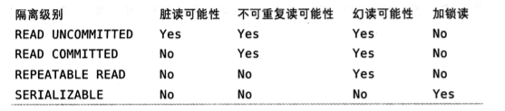

# MySQL架构

## 1. 逻辑结构

  

  三层结构：
  - 最上层服务并不是MySQL所独有的，大多数基于网络的客户端、服务器的工具或者服务都有类似的架构。比如连接处理、授权认证、安全等等。
  - 第二层是MySQL核心的功能，包括查询解析、分析、优化、缓存以及所有的内置函数（日期、时间、数字和加密函数等），所有跨存储引擎的功能都在这一层实现：存储过程、触发器、视图等。
  - 第三层包含了存储引擎，负责数据的存储和提取。服务器通过API与存储引擎进行通信。这些接口屏蔽了不同存储引擎之间的差异，使得这些差异对上层的查询过程透明。另外提一点，存储引擎不回去解析SQL（PS:InnoDB是一个例外，它会解析外键定义，因为本身MySQL没有实现该功能）

## 2.并发控制
  - 读写锁
  - 锁粒度

   - 表锁,是MySQL中最基本的锁策略，并且是开销最小的策略。某些场景下表锁也可能有良好的性能，比如READ LOCAL表锁支持某些类型的并发写操作。写锁也比读锁拥有更高的优先级。

   - 行锁，可以最大程度的支持并发处理（同时也带来了最大的锁开销）。MySQL只有InnoDB支持行锁，锁机制是在存储引擎中实现的。

## 3. 事务
 即通常的ACID概念。

## 4. 隔离级别
 在SQL标准中定义了四种隔离级别，每种隔离级别都规定了一个事务中所做的修改，哪些在事务内和事务间是可见的，哪些是不可见。较低的隔离级别通常可以执行更高的并发，系统的开销也更低。

 四种隔离级别分别是：
  - READ UNCOMMITTED (未提交读)
  - READ COMMITTED (提交读)
  - REPEATABLE READ (可重复读)
  - SERIALIZABLE (串行)

级别自上而下一次递增，第一个是会出现脏读的情况，第二个会出现不可重复读，第三个会出现幻读的情况，第四个是所有的SQL执行都严格按照顺序执行，也是效率最低的一种。不可重复读是指在一个事务内执行两次同样的查询可能会得到不一样的结果。幻读是指在一个事务内读取某个范围内的记录时，另外一个事务又在该范围内插入了一个新的记录，当前事务再次读取时就会产生幻行的情况。不可重复读侧重点是指单行数据的内容发生了变换，幻读侧重点是查询范围内的数据行数量发生了变化，

下图分别列举了隔离级别对不同情况的影响

