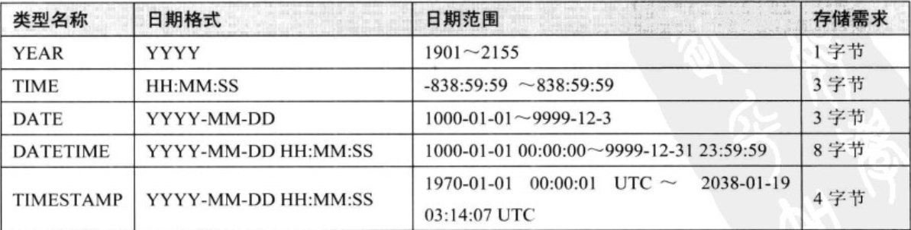

# 数据类型基础知识

## 数字类型
### 1. 整数类型

数据类型 | 占用空间大小 | 有符号取值范围| 无符号取值范围
-------|--------|---------|---------|
TINYINT | 1字节  | -128~127 | 0~256
SMALLINT | 2字节  | -32768~32767| 0~65535
MEDIUMINT | 3字节  | -8388608~8388607| 0~16777215
INT | 4字节 | -2147483648~2147483647 | 0~4294967295
BIGINT | 8字节 | -9233372036854775808~9223372036854775807 | 0~18446744073709551615

### 2. 小数（浮点类型和定点类型）
数据类型 | 占用空间
-------| -------
FLOAT  | 4字节
DOUBLE | 8字节
DECIMAL(M, D) | M+2字节

- 单精度和双精度不是精确存储，如果对精度要求比较高的场景使用DECIMAL类型。如果超出了精度范围则做四舍五入的处理。
- 定点类型存储精确的数字值，最多允许65个数字。

## 字符串类型
 - CHAR、VARCHAR

  CHAR是固定长度的字符串，以空格填充不足长度的。
  VARCHAR是变长字符串，根据实际使用自动伸缩。

 - BINARY、VARBINARY

 和CHAR、VARCAHR很像，只不过它们存储的是二级制数据，而CHAR、VARCHAR存储的是字符串。
 二进制中指定的长度是字节大小，而不是想CHAR、VARCHAR中的字符长度的大小。

 - BLOB、TEXT

 BLOB和TEXT是为了存储很大的数据设计的字符串数据类型，分别采用二进制和字符串存储。BLOB和TEXT仅有的不同是BLOB类型存储的是二进制数据，没有排序规则或字符集，而TEXT类型有字符集和排序规则。

 - [ENUM](https://dev.mysql.com/doc/refman/5.7/en/enum.html)、[SET](https://dev.mysql.com/doc/refman/5.7/en/set.html)

 ENUM和SET都是预先指定一个固定的字符串的集合，来限定插入的数据。ENUM字段只能多选一、而SET可以选多种组合。
 要注意ENUM类型的一些坑：
  1. 如果可能会发生变动，使用枚举可能不是一个好的方案。
  2. MySQL在内部将每个值在列表中的位置保存为整数，排序的时候是按照整数排序而不是按照字符串进行排序。
  3. 枚举类型必须进行查找的时候才能转换为字符串，尽量避免定义数字类型的枚举常量ENUM('1', '2', '3')。

## 日期和时间类型
 1. 精度以及所占存储空间如下图所示

  

 2. 目前MySQL5.6.4及以上的版本已经支持毫秒、微秒时间的存储，详情见[链接](https://dev.mysql.com/doc/refman/5.7/en/fractional-seconds.html)。

 # 选择标识符（identifier）一些原则

 - 尽量选择和关联表中对应列一样的类型。
 - 整数类型时最好选择，因为它很快而且可以使用AUTO_INCREMENT。
 - ENUM和SET类型，是一个糟糕的选择，除非有合理的场景，大部分情况下都要避免这么做。
 - 字符串类型作为标识符，很消耗空间，通常比数字类型慢。对于完全“随机”的字符串需要注意，（MD5、SHA1、UUID产生的字符串）。这些值会任意的分布在很大的空间内，这会导致INSERT以及一些SELECT语句变得很慢。
 如果存储UUID值，则应该移除‘-’符号，或者更好的做法是用UNHEX()函数转换UUID值为16字节的数字，并且存储在一个BINARY(16)列中，检索时可以通过HEX()函数来格式化为十六进制格式。

 # 特殊类型数据
  比如IPV4地址，不应该使用VARCHAR(15)类型来存储。然而它实际上是32位无符号整数，用小数点只是为了方便阅读，所以在MySQL中应该用无符号整数来存储IP地址，MySQL提供了INET_ATON()和INET_NTOA()函数来进行转换。

# 范式和反范式

 - 关于范式的介绍可以参考
  - [解释一下关系数据库的第一第二第三范式？](https://www.zhihu.com/question/24696366)
  - [数据库（第一范式，第二范式，第三范式）](http://blog.csdn.net/famousdt/article/details/6921622)

 - 范式的优点和缺点
  - 范式化的更新操作通常比范式化要快。
  - 当数据较好的范式化时，就只有很少或者没有重复数据，所以只需要修改更少的数据。
  - 范式化的表通常更小，可以更好的放到内存里，所以执行操作会更快。
  - 很少有多余的数据意味着检索列表数据时更少需要DISTINCT或者GROUP BY语句。
 范式化设计的缺点是通常需要关联，稍微复杂一些的语句可能需要至少一次关联，也许更多。
 - 反范式的优点和缺点

   反范式化的设计，可以适当做字段的冗余，可以很好的避免关联。

 - 混用范式化和反范式化

  完全的范式化和完全反范式化的设计实际应用中很少出现，大部分的情况都是混用。最常见的反范式化数据的方法就是复制或者缓存，在不同的不同的表中存储相同的列。

# 物化视图
物化视图实际上是预先计算并且存储在磁盘上的表，Oracle和SQL Server都提供了该功能，MySQL并不原生支持物化视图。
 推荐开源工具[Flexviews](https://github.com/greenlion/swanhart-tools/tree/master/flexviews)来自己实现物化视图。
